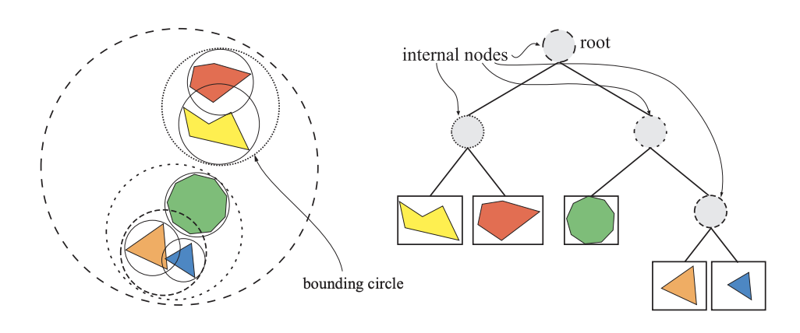

# 第四讲.加速算法(Acceleration Algorithms)
## 空间数据结构(Spatial Data Structures)
空间数据结构是将几何体组合在N维空间中的一系列数据结构，而且我们很容易地将二维和三维的一些概念扩展到高维之中。这些空间数据结构可以用于很多实时渲染相关操作的加速查询中，如场景管理，裁剪算法，相交测试，光线追踪，以及碰撞检测等。  
空间数据结构的组织通常是层次结构的。宽泛的说，即顶层包含它之下的层次，具有嵌套和递归的特点。这种递归可以将复杂度从O(n)提升到O(log n)。这种层次结构的构造开销都比较大，虽然可以在实时过程中进行渐进更新，但是通常需要作为一个预处理的过程来完成。
### 层次包围盒(BVH, Bounding Volume Hierarchies)
层次包围盒方法的核心思想是用体积略大而集合特征简单的包围盒来近似地描述复杂的几何对象，从而只需对包围盒重叠的对象进行进一步的相交测试。此外，通过构造树状结构层次，可以越来越逼近对象的几何模型，直到几乎完全获得对象的几何特征。  
对于三维场景的实时渲染来说，层次包围盒是最常用的，例如，层次包围盒经常用于层次视锥裁剪。场景以层次树结构进行组织，包含一个根节点，一些内部节点，以及一些叶子节点。顶部的节点是根，其无父节点。叶子节点包含需要渲染的实际几何体，并且没有子节点。  
相比之下，内部节点包含指向它子节点的指针。因此，只要根节点不是这棵树唯一的节点，那么它就是一个内部节点。树中的每一个节点，包括叶子节点，都有一个包围体可以将其子树中的所有几何体包围起来，这就是层次包围盒命名的来源，同时，也说明了根节点有一个包含整个场景的包围体。

左图中有五个物体，每个物体由一个包围的球体封闭起来，其中可以将包围球体归组为一个更大的包围球体。右图所示为层次包围体，可以用来表示左图的物体层次、根节点的包围体包含场景中的所有物体。
### 二元空间分割树/BSP树(Binary Space Partitioning trees)
图形学中的BSP树有两种明显不同的变体存在，分为轴对齐（axis-aligned)和多边形对齐(polygon-aligned)。他们通过一个平面将空间一分为二，然后将几何图形分类到这两个空间中来创建树。这种划分是递归完成的。一个有价值的特性是，如果以某种方式遍历BSP树，则可以从任何角度对树的几何内容进行前后排序，这种排序对于轴对齐来说是近似的排序，但是对于多边形对齐来说是精确的。其中轴对齐的BSP也称为k-d树。
### K-D trees(k-dimensional trees)/Axis-Aligned BSP Trees

### 八叉树(Octrees)
### 场景图(Scene Graphs)
## 裁剪技术(Culling Techniques)
### 背面裁剪(Backface Culling)
### 视锥裁剪(View Frustum Culling)
### 入口裁剪(Portal Culling)
### 细节和小三角形裁剪(Detail and Small Triangle Culling)
### 遮挡裁剪(Occlusion Culling)
## LOD(Level of Detail)
### LOD切换(LOD Switching)
### LOD选取(LOD Selection)
## 大型场景渲染(Rendering Large Scenes)
### 虚拟纹理和流(Virtual Texturing and Streaming)