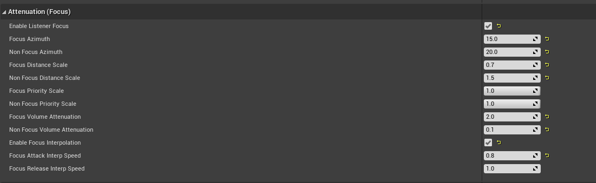
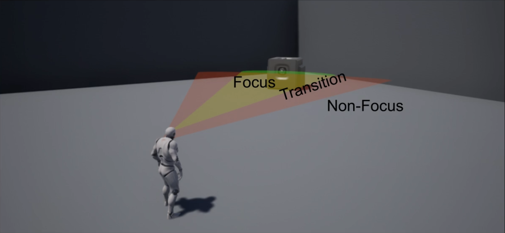
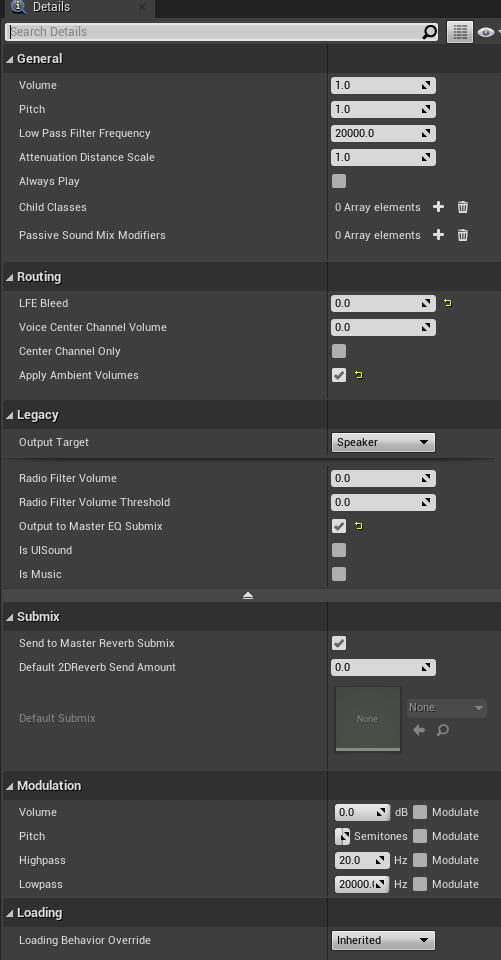
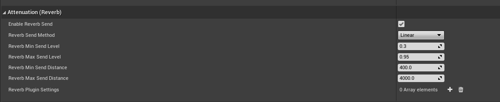
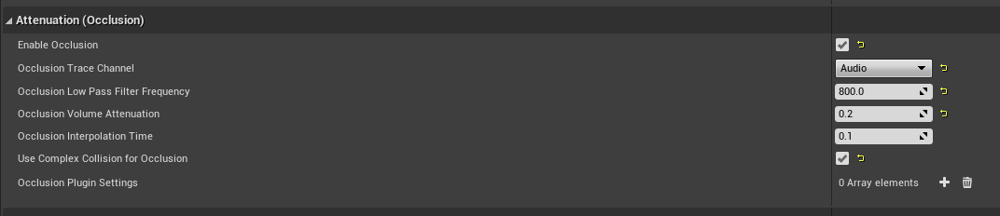

# 文件说明
- SoundWave: 音波文件，由原始的.wav格式音频导入到UE里面形成的uasset文件
- SoundCue：音效对象，内部播放的是SoundWave文件，内部可能会使用多个SoundWave文件来实现特定的播放效果，比如从多个SoundWare中随机播放一个，建议播放音效的时候尽量使用音效对象
- SoundClass：音效类，可以用来将音效划分类型，对这一类型的所有音效进行统一管理，配合被动混音修改器一起使用。音效类可以用来对SoundWave和SoundCue进行分类
- SoundClassMix：音效类混合，对不同类型音效进行混合的时候的混合规则，比如音量在混合的时候，类型A和类型B的音量分别怎么变化
- SoundSubMix: 音效子混合
- SoundConcurrency：音效并发设置
- SoundSourceBus: 音源总线

# 概念介绍
- 低通滤波器：频率低于这个设定值的音效信号能通过，高于这个值的音效信号不能通过对一种滤波设置。
- 高通滤波器：和低通相反，高于这个设定值的音效信号能通过，低于这个值的音效信号不能通过
- 声道 a.b.c: a.b.c声道音响系统就是由a个前后左右环绕的扬声器+b个低音炮+c个天空扬声器，共计a+b+c个扬声器组成的总计a+b+c个声道的系统，比如5.1声道就是5个环绕扬声器+1个低音炮，a = 1就是单声道，a = 2就是立体声，5.1，7.1就是环绕声。
- 干音，湿音：干音就是最原始的声音，没有添加任何修饰处理的声音。湿音就是在干音的基础上经过后期处理的声音，对干音添加了一些EQ，压缩，混响等效果。
# 音效播放方式
## 蓝图(C++类似)

这个是只管播放一个声音，触发播放了就没法再对这个声音进行控制了

这是先创建一个AudioComponent对象，然后我们对这个对象进行操作，包括播放，停止，修改音量，淡入淡出等。
## notify

这种方式是在动画蒙太奇里面播放音效，通过向track添加播放音效的通知，就能控制在动画执行的某一帧上播放一个音效。

# 音量设置

# 混音修改器
## 配置规则
在使用混音修改器之前，我们需要建立混音规则，需要创建SoundClass和SoundClassMix。
新建SoundClass：Content Browser空白处右键->Sounds->Classes->Sound Class，就能新建一个SoundClass，我们可以对多个SoundClass建立树形结构。比如像下面这种

新建SoundClassMix: Content Browser空白处右键->Sounds->Classes->Sound Class Mix
接下来就是创建这个混合规则，我们看这个例子

这个名为DuckforDialogue的混合，里面Sound Class Effects里面添加了三个类型，说明这个音效类混合是针对这三个类型的音频来进行混合的，其中Music和SFX类型的Sound的音量会变成原来的0.2, Dialogue保持不变，也就是说当这三种类型的声音同时播放的时候，会降低Music和SFX的音量，以凸显Dialogue的声音。
## 用法
- 设置到SoundClass，这个是被动音效混合修改器

上图中是直接在SoundClass的被动混音修改器里面添加的混音配置，从名字可以知道这个效果是被动的，只要这个类型的音效被播放，就会自动触发这个混合效果。
- 蓝图

在蓝图里面，可以调用PushSoundMixModifer和PopSoundMixModifer来手动激活和停用某个音效混合修改器，这里就不是被动的了，因为我们手动控制了混合修改器的开始和结束时间。
注意:这里的mix是会累乘的，一定要注意!!!
# 衰减和空间化

## 衰减
启用衰减可以使得音效更加具备空间感，使音频变成3D音频  
(注意，这里的音波文件需要具备至少两个通道，实测只有一个通道的音波文件在空间化后只有一只耳机有声音。)

这里的Num Channels需要>=2，也就是这个音频文件至少是双声道的。
## 用法
- SoundCue里面使用
1.使用衰减配置文件

这里的NPC就是一个衰减配置文件，我们可以把一种统一的衰减配置做成一个文件，然后在需要使用这种配置的地方都使用这种配置文件，注意这里要勾掉Override Attenuation选项，不然这个Attenuation Setting不会生效。衰减文件的创建方式Content Browser空白处右键->Sounds->Sound Attenuation即可
2.使用衰减重载

这种情况下就是我们需要单独对这个Cue进行衰减设置，不使用统一的配置，因此这里勾选了Override Attenuation，会忽略掉这里的Attunuation Setting，并且下面多出来了几个关于衰减的设置，这里就类似于类继承里面重载了基类的设置，使用当前的配置，而不使用Attenuation Setting
- SoundWave里面使用

在SoundWave里面只能使用Attnuation Setting，不能使用重载设置
- AmbientSound里面使用

这里和SoundCue里面不一样的是，多了一个Allow Spatialization的选项，如果需要有衰减的效果，这里一定要勾选上Allow Spatialization才能生效，不然这个音效就是一个2D音效。Override Attenuation和Attenuation Settings和上面讲解的一样。
### 衰减(音量)
音量衰减是3D音效一个非常明显的表现，当聆听者在离音源比较近的一个范围内音量保持在一个最大的音量上，随着聆听者越来越远离音源，音量开始降低，直到声音消失。

这里可以选择衰减函数和衰减形状, 具体查看官方手册
[音效衰减](https://docs.unrealengine.com/4.26/zh-CN/WorkingWithMedia/Audio/DistanceModelAttenuation/)
### 衰减(空间化)
音效的空间化使得音效随着聆听者的移动而相应平移，如果戴上耳机，左右耳朵听到的音量大小是不一样的。此时的音效是一个立体声，具备左右两个声道。 

这里红色和绿色的标记表示这个音效的两个通道

这里的非空间化半径设置为500，也就是说如果聆听者距离音源5米之外，就能听到一个立体声，如果聆听者距离音源小于5米，那么这个音源就会变成2D音效，从空间化变成非空间化，此时音效的所有声道都会进入扬声器的所有声道，比如左右声道全部会进入5.1扬声器的5个声道中。这个就是非空间化半径的效果，此属性适用于在接近声源时防止音效的空间位置上出现突然不和谐声音跳跃。近距离时，此属性还能够"大型"音效充满空间区域  
这里的3D立体声扩散就表示上图中红绿标识的距离，也就是这个立体声左右两个声道之间的距离，如果这个值设的比较大当我们离的远也能更容易听到左右声道的区别。当然随着距离的进一步拉远，我们最终还是会听到左右声道叠加在一起变成单声道的效果。这种情况下又会出现另外一个问题，本来左右声道的音量足够大的情况下，叠加的音量就更大了，可能会出现音效重叠，这里就需要设置标准化3D立体音效，他会使用一个-6dB衰减来避免这种问题。  
这里的空间化方法设置为平移，此选项为默认选项，使用UE4的标准平移方法来计算空间定位。使用此方法时，无论使用线性或等幂平移，都可将其定义为全局项目设置。可在项目设置（Project Settings）>引擎（Engine）>音频（Audio）>质量（Quality）>平移方法（Panning Method）中找到此选项。若通过扬声器播放，使用此方法效果最佳。
### 衰减(空气吸收)
声音穿过空气会损失能量，到目前为止，我们通过使用衰减函数呈现音效随距离出现衰减，从而模仿出这种效果。但是空气对于高频声音都能量吸收效果要高于对低频声音的吸收效果，所以低频的声音往往能传播地更远。我们可以使用衰减空气吸收设置来模仿高频声音随距离而产生的衰减。使用这个功能之后，你将会发现所有的音效都变得更加真实

这里有一个距离范围，在这个最小和最大距离区间内应用滤波器，用低通滤波器来模拟空气吸收，用高通滤波器来减少随距离变化的音效感知大小。
这里的距离范围为0.5-4米，在0.5米的时候生效的是Low Pass Cutoff Frequency Mix和High Pass Cutoff Frequency Min，在4米的时候生效的是Low Pass Cutoff Frequency Max和High Pass Cutoff Frequency Max，在这个范围区间的其他位置的值是利用最小和最大的值进行插值得到的。这里的最小距离低通截止频率是20000，最大距离的低通截止频率是0，因为低通表示的是频率低于这个值的才能通过，在最小距离的时候能听到频率不超过20000的音效，这时候这个值会设置的比较大，因为没有太多的空气吸收，在最大的距离时，低通频率为1000，表示只能听到小于1000频率的声音，高频声音都被空气吸收了。在最小距离的时候，高通滤波器是0，就表示频率高于0的都能听到，在最大距离时，高通滤波器为500，表示只能听到500以上的音频。合起来就是在最小距离的情况下，能听到0-20000这个频率范围的声音，在最大距离的情况下，能听到500-1000范围的声音，随着距离的增加，能听见的声音范围逐渐变小，高频部分减少的更快。  
在距离范围内的插值默认的是线性插值，可能会出现一些极端和不自然的音效。因此可以勾选Enable Log Frequency Scaling来平滑的处理这些变化。  
吸收方法默认的是线性的(线性或者对数，取决于Enable Log Frequency Scaling是否勾选)，我们也可以自定义曲线来确定如何随着滤波距离的变化来插值。

### 衰减(聚焦)
聚焦是一种针对聆听者的朝向，聚焦在前方某个空间范围的音效会被突出，而范围之外的音效会被弱化的一种表现

Focus Azimuth表示的是图里面绿色扇形的角度，Non Focus Azimuth表示的是图里面红色扇形的角度。Focus Distance Scale表示在聚焦区域内的音效距离聆听者的距离和实际距离的缩放值，如果小于1，就表示这个音效听起来比他原来的位置更近。Non Focus Distance Scale表示在非聚焦区域内的音效听起来的距离和实际距离的比值，如果大于1，表示这个音效听起来比实际更远。这样就能让聚焦的音效听起来更大，因为衰减更小。Focus Priority Scale和Non Focus Priority Scale表示的是优先级的缩放，如果大于1，表示这个优先级会变高，在并发音效数量达到最大的时候就不会被停止，我们趋向于在聚焦区域内把音效优先级提高，把非聚焦区域内的音效优先级降低。同理Focus Volume Attenuation和Non Focus Volume Attenuation，表示的是音效音量的缩放值，在距离缩放值的基础上，再对音量进行缩放，如果大于1，比如这里的2就表示在聚焦区域内部，音量会加倍，而在非聚焦区域的音量会变成原来的0.1倍。  
后面是插值的设置，当音效进入或者超出聚焦和非聚焦范围时，我们就要用它来完成平滑的过渡。这个插值数值越小，过渡的时间就越长。Focus Attack Interp Speed表示从非聚焦区域移动到聚焦区域的插值速度，Focus Release Interp Speed表示从聚焦区域移动到非聚焦区域的插值速度。而Enable Focus Interpolation就是启用和关闭这两个插值设置的开关。
### 衰减(混响)
这里会决定一个音效的混响程度，当然这个要生效的前提是这个音效的类允许混合，勾选了下面Submix中的Send Master Reverb Submix

类似于上面的空气吸收，这里的混响也定义了一个最大最小距离Reverb Max Send Distance和Reverb Min Send Distance, 然后定义了Reverb Max Send Level和Reverb Min Send Level，意思就是在最大和最小距离上应用不同的混响发送等级，这里的发送等级就是定义的把多少声音发送给master Reverb。也就是在距离400的时候，把0.3的声音发送给混响，在距离为4000的时候把0.95的声音发送给混响，也就是在距离近的时候，混响的比例低，声音几乎就是干音，在距离远的时候混响的比例高。在这个距离之间的部分就采用插值的方式来计算多少音效被发送给混响。这里的插值方式有线性，定义曲线和手动插值，手动插值就是设置一个恒定的混响发送音效量，不会随着距离而变化。
### 衰减(遮挡)
相对于音效体积遮挡，这种方法可以更加细致地让音效被游戏中的某个物体遮挡。

系统会在音源和聆听者之间使用光线投射，如果这个过程中遇到了遮挡物，这里的衰减遮挡就会生效。这里的Occlusion Trace Channel默认是Visibility，适用于大多数目的，但是如果这个遮挡物的碰撞中将Visibility设置为Ignore，那么这里就不能用Visibility来做判定声音是否被遮挡，因为光线投射不会被碰撞检测到，这里是自定义的一个channel来做的。  
这里的Occlusion Low Pass Frequency是在遮挡发生时应用的低通滤波器的频率，这里表示遮挡发生时，频率高于800的音效部分会听不见。Occlusion Volume Attenuation则是音效的缩放值，这里的0.2就表示在遮挡发生的时候，音量会变成原来的0.2倍。由于在遮挡发生的时候直接应用音量缩放和低通滤波器的话，效果比较突兀，因此，这里应用了Occlusion Interpolation Time来做一个渐入渐出的效果。

# 源效果

# 音频体积

# 总线

# submix

# 混响
## 音频体积
## 延迟
## 卷积

# 侧链压缩

# 优先级和并发

# 调试
