# 文件说明
- SoundWave: 音波文件，由原始的.wav格式音频导入到UE里面形成的uasset文件
- SoundCue：音效对象，内部播放的是SoundWave文件，内部可能会使用多个SoundWave文件来实现特定的播放效果，比如从多个SoundWare中随机播放一个，建议播放音效的时候尽量使用音效对象
- SoundClass：音效类，可以用来将音效划分类型，对这一类型的所有音效进行统一管理，配合被动混音修改器一起使用。音效类可以用来对SoundWave和SoundCue进行分类
- SoundClassMix：音效类混合，对不同类型音效进行混合的时候的混合规则，比如音量在混合的时候，类型A和类型B的音量分别怎么变化
- SoundSubMix: 音效子混合
- SoundConcurrency：音效并发设置
- SoundSourceBus: 音源总线

# 概念介绍
- 低通滤波器
- 高通滤波器
- 声道 X.Y.Z
# 播放方式
## 蓝图
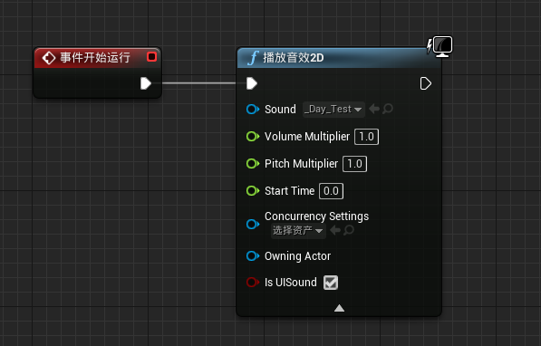
这个是只管播放一个声音，触发播放了就没法再对这个声音进行控制了
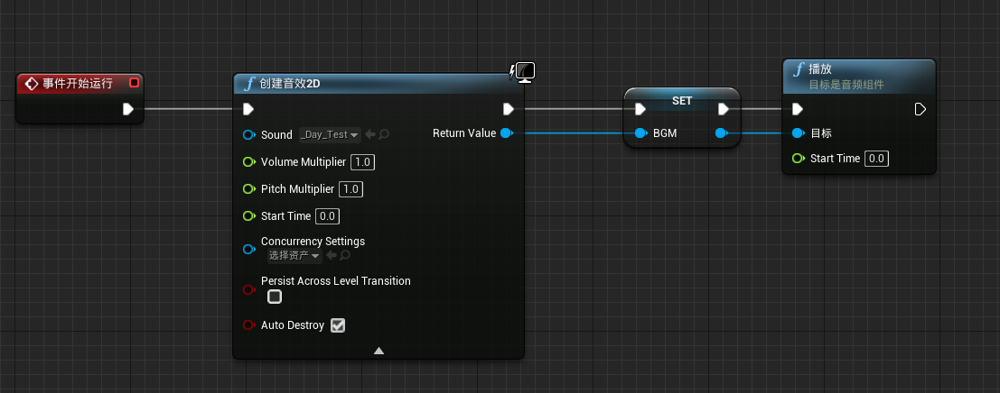
这是先创建一个AudioComponent对象，然后我们对这个对象进行操作，包括播放，停止，修改音量，淡入淡出等。
## notify
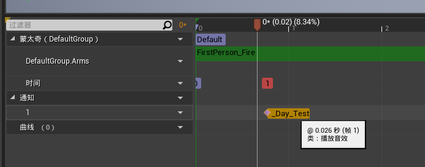
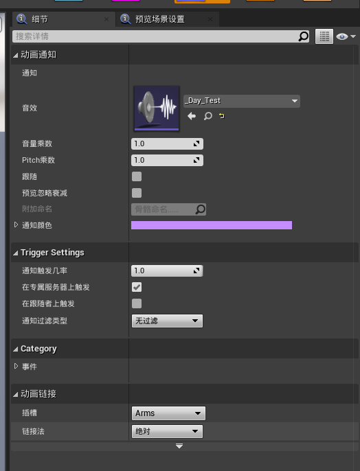
这种方式是在动画蒙太奇里面播放音效，通过向track添加播放音效的通知，就能控制在动画执行的某一帧上播放一个音效。

# 音量设置

# 混音修改器
## 配置规则
在使用混音修改器之前，我们需要建立混音规则，需要创建SoundClass和SoundClassMix。
新建SoundClass：Content Browser空白处右键->Sounds->Classes->Sound Class，就能新建一个SoundClass，我们可以对多个SoundClass建立树形结构。比如像下面这种
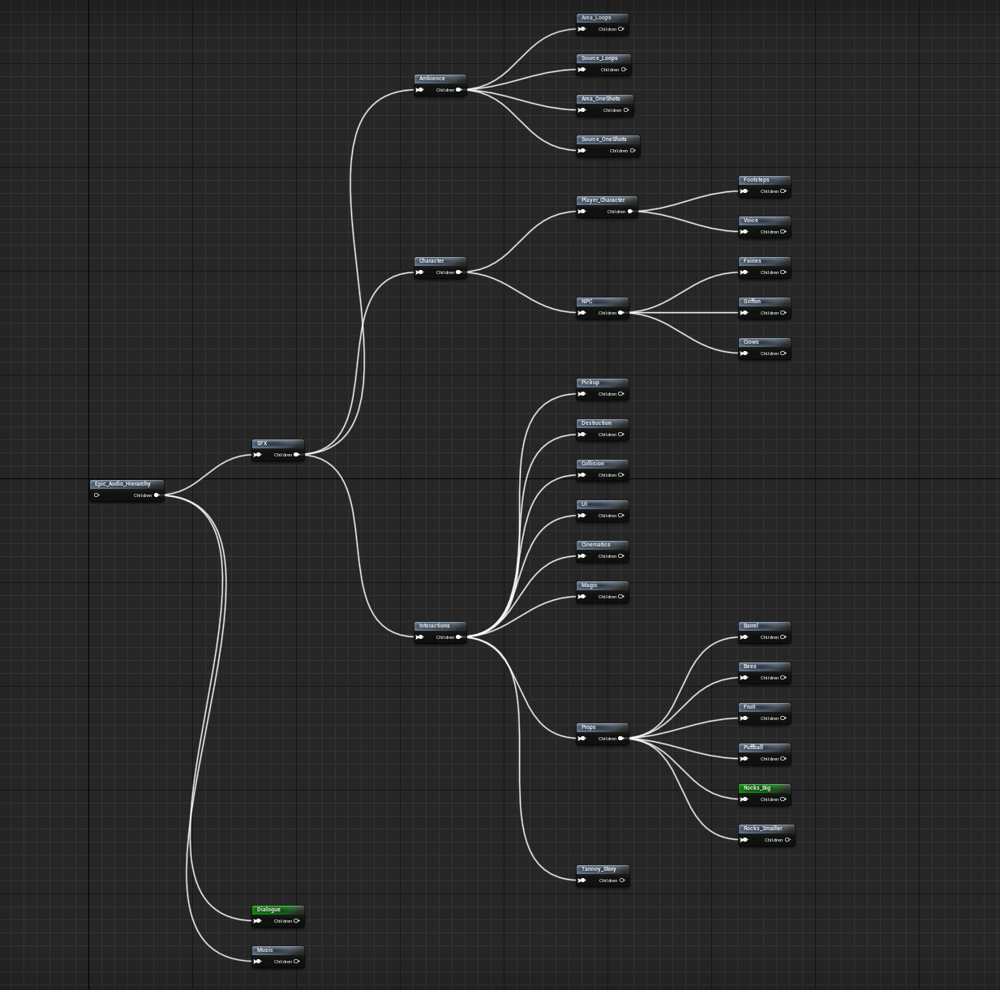
新建SoundClassMix: Content Browser空白处右键->Sounds->Classes->Sound Class Mix
接下来就是创建这个混合规则，我们看这个例子
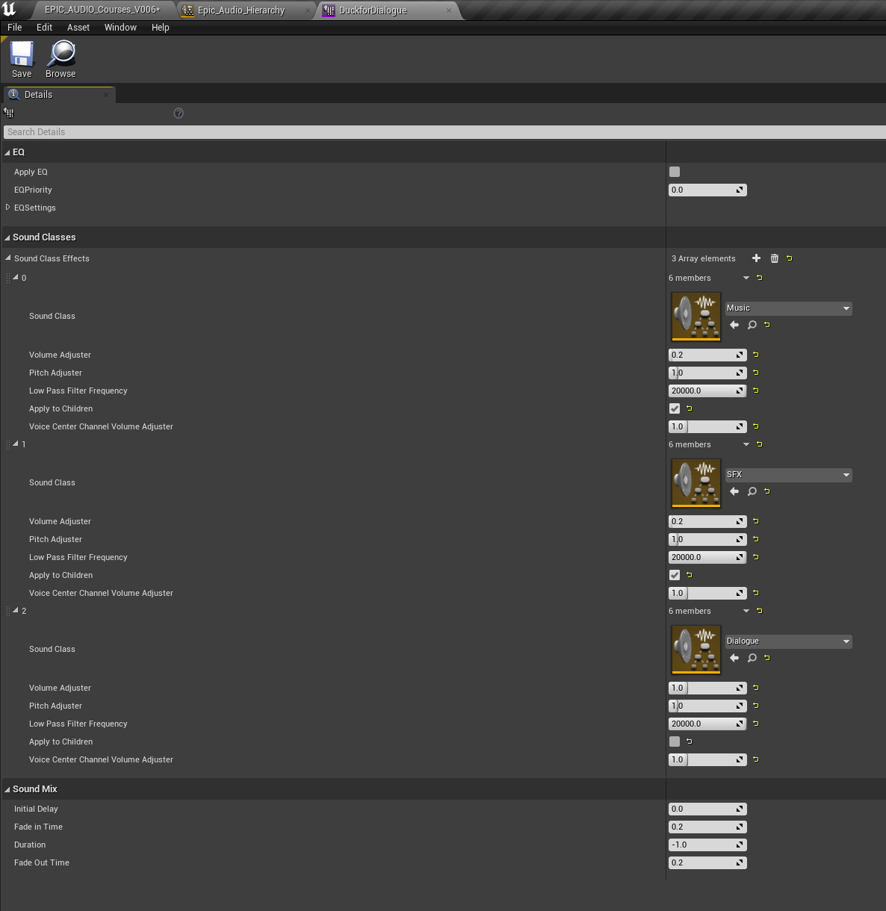
这个名为DuckforDialogue的混合，里面Sound Class Effects里面添加了三个类型，说明这个音效类混合是针对这三个类型的音频来进行混合的，其中Music和SFX类型的Sound的音量会变成原来的0.2, Dialogue保持不变，也就是说当这三种类型的声音同时播放的时候，会降低Music和SFX的音量，以凸显Dialogue的声音。
## 用法
- 设置到SoundClass，这个是被动音效混合修改器
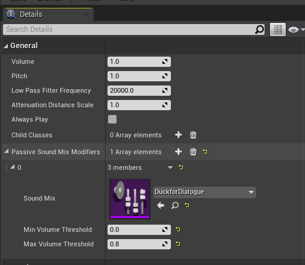
上图中是直接在SoundClass的被动混音修改器里面添加的混音配置，从名字可以知道这个效果是被动的，只要这个类型的音效被播放，就会自动触发这个混合效果。
- 蓝图
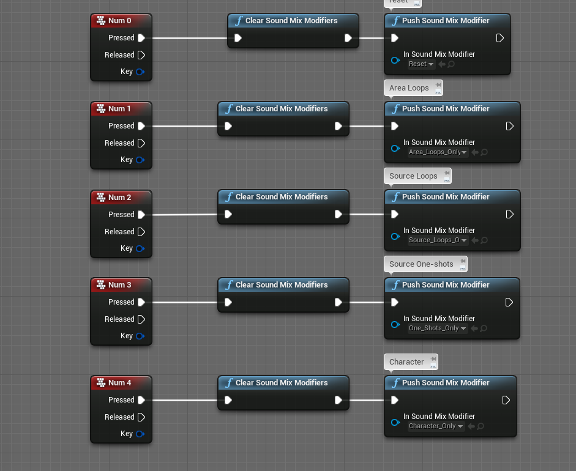
在蓝图里面，可以调用PushSoundMixModifer和PopSoundMixModifer来手动激活和停用某个音效混合修改器，这里就不是被动的了，因为我们手动控制了混合修改器的开始和结束时间。
注意:这里的mix是会累乘的，一定要注意!!!
# 衰减和空间化

## 衰减
启用衰减可以使得音效更加具备空间感，使音频变成3D音频  
(注意，这里的音波文件需要具备至少两个通道，实测只有一个通道的音波文件在空间化后只有一只耳机有声音。)
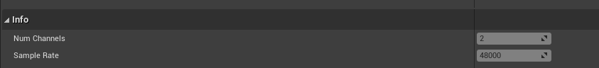
这里的Num Channels需要>=2，也就是这个音频文件至少是双声道的。
## 用法
- SoundCue里面使用
1.使用衰减配置文件
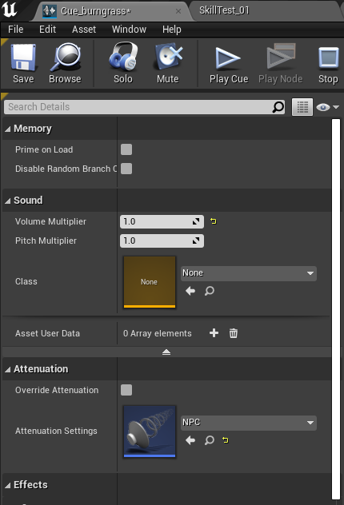
这里的NPC就是一个衰减配置文件，我们可以把一种统一的衰减配置做成一个文件，然后在需要使用这种配置的地方都使用这种配置文件，注意这里要勾掉Override Attenuation选项，不然这个Attenuation Setting不会生效。
2.使用衰减重载
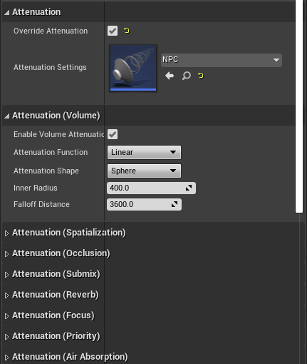
这种情况下就是我们需要单独对这个Cue进行衰减设置，不使用统一的配置，因此这里勾选了Override Attenuation，会忽略掉这里的Attunuation Setting，并且下面多出来了几个关于衰减的设置，这里就类似于类继承里面重载了基类的设置，使用当前的配置，而不使用Attenuation Setting
- SoundWave里面使用
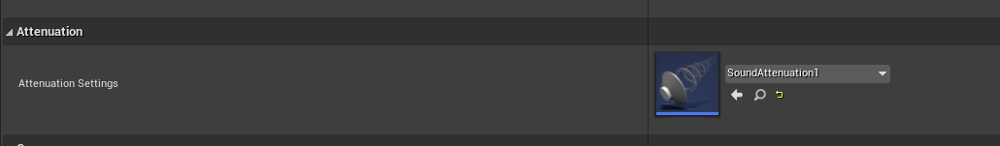
在SoundWave里面只能使用Attnuation Setting，不能使用重载设置
- AmbientSound里面使用
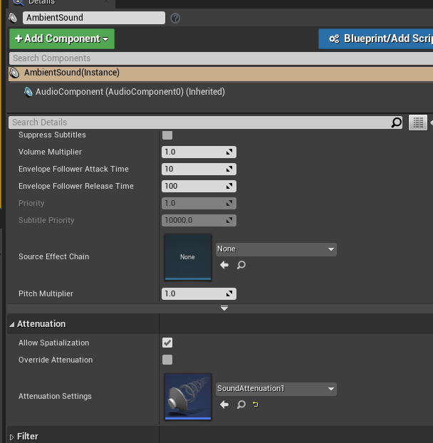
这里和SoundCue里面不一样的是，多了一个Allow Spatialization的选项，如果需要有衰减的效果，这里一定要勾选上Allow Spatialization才能生效，不然这个音效就是一个2D音效。Override Attenuation和Attenuation Settings和上面讲解的一样。
### 衰减音量
音量衰减是3D音效一个非常明显的表现，当聆听者在离音源比较近的一个范围内音量保持在一个最大的音量上，随着聆听者越来越远离音源，音量开始降低，直到声音消失。
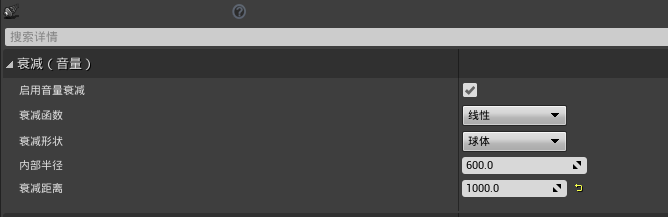
这里可以选择衰减函数和衰减形状, 具体查看官方手册
[音效衰减](https://docs.unrealengine.com/4.26/zh-CN/WorkingWithMedia/Audio/DistanceModelAttenuation/)
### 衰减空间化
音效的空间化使得音效随着聆听者的移动而相应平移，如果戴上耳机，左右耳朵听到的音量大小是不一样的。此时的音效是一个立体声，具备左右两个声道。 
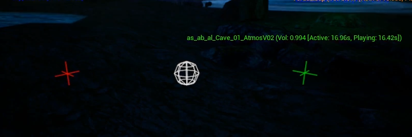
这里红色和绿色的标记表示这个音效的两个通道
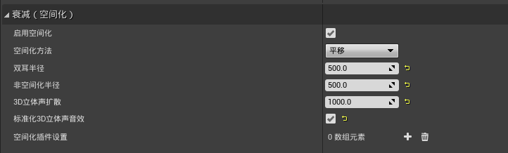
这里的非空间化半径设置为500，也就是说如果聆听者距离音源5米之外，就能听到一个立体声，如果聆听者距离音源小于5米，那么这个音源就会变成2D音效，从空间化变成非空间化，此时音效的所有声道都会进入扬声器的所有声道，比如左右声道全部会进入5.1扬声器的5个声道中。这个就是非空间化半径的效果，此属性适用于在接近声源时防止音效的空间位置上出现突然不和谐声音跳跃。近距离时，此属性还能够"大型"音效充满空间区域  
这里的3D立体声扩散就表示上图中红绿标识的距离，也就是这个立体声左右两个声道之间的距离，如果这个值设的比较大当我们离的远也能更容易听到左右声道的区别。当然随着距离的进一步拉远，我们最终还是会听到左右声道叠加在一起变成单声道的效果。这种情况下又会出现另外一个问题，本来左右声道的音量足够大的情况下，叠加的音量就更大了，可能会出现音效重叠，这里就需要设置标准化3D立体音效，他会使用一个-6dB衰减来避免这种问题。  
这里的空间化方法设置为平移，此选项为默认选项，使用UE4的标准平移方法来计算空间定位。使用此方法时，无论使用线性或等幂平移，都可将其定义为全局项目设置。可在项目设置（Project Settings）>引擎（Engine）>音频（Audio）>质量（Quality）>平移方法（Panning Method）中找到此选项。若通过扬声器播放，使用此方法效果最佳。
### 衰减空气吸收
声音穿过空气会损失能量，到目前为止，我们通过使用衰减函数呈现音效随距离出现衰减，从而模仿出这种效果。但是空气对于高频声音都能量吸收效果要高于对低频声音的吸收效果，所以低频的声音往往能传播地更远。我们可以使用衰减空气吸收设置来模仿高频声音随距离而产生的衰减。使用这个功能之后，你将会发现所有的音效都变得更加真实
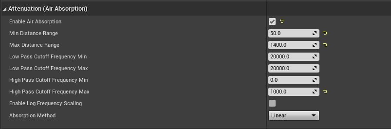

### 衰减聆听者聚焦
### 衰减混响发送

# 源效果

# 总线

# 子混合和子混合发送

# 混响
## 音频体积
## 延迟
## 卷积

# 侧链压缩

# 优先级和并发

# 调试
