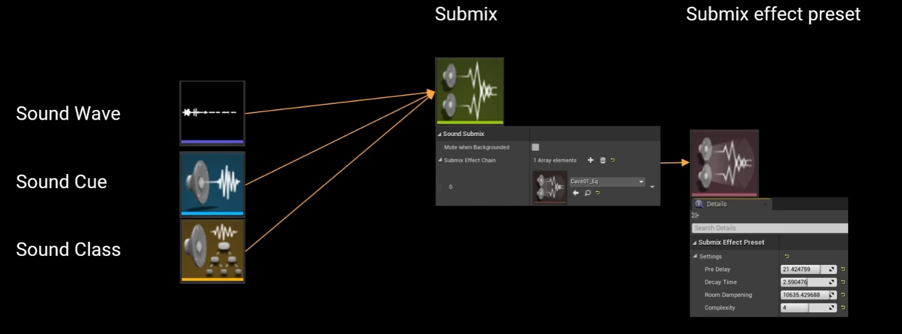
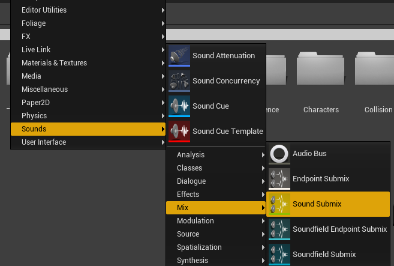
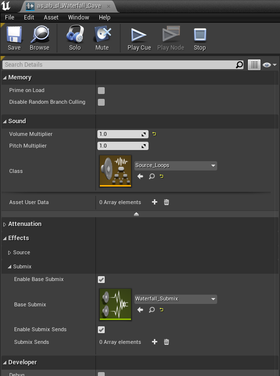
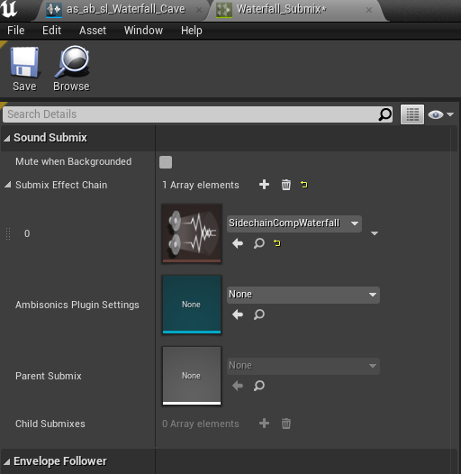
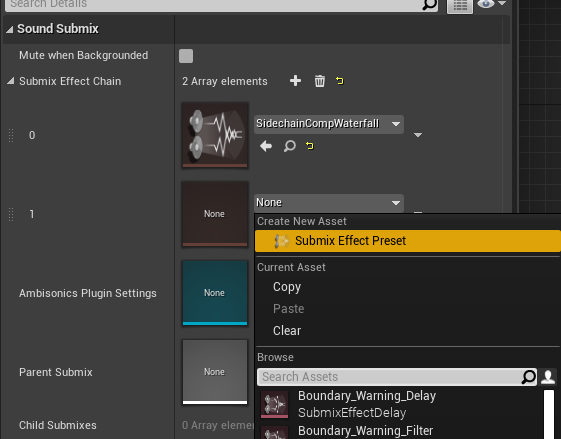
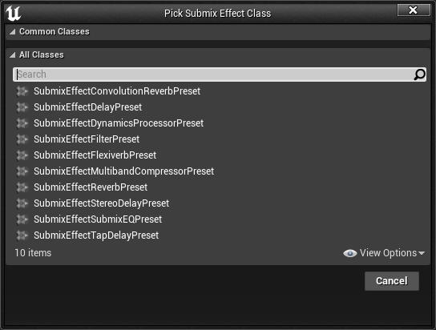
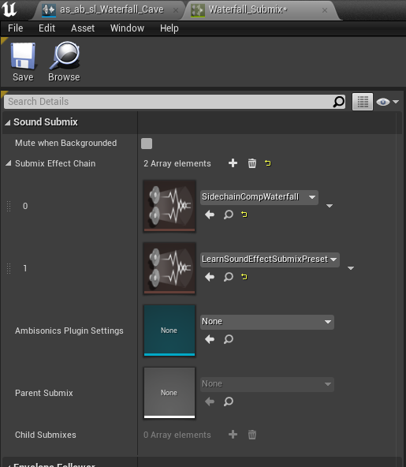

# 子混音
子混音(Submix)和之前提到的混音(Sound Mix)是不同的概念，混音是针对不同的音效类型，用来做不同类型的音量控制操作。而Submix是对音效进行后期特效处理，通过Submix Send，把音效发送给Submix，然后使用子混音里面的效果链，对音效进行处理。注意，音效是在应用距离衰减和空间化之后才会被发送给Submix
## 使用方式 

从图里可以看到左边是三种类型的文件，Sound Wave、Sound Cue、Sound Class都可以设置Submix文件，然后我们在Submix里面设置好想要的Submix Effect Chain数组，可以设置多个效果，这个数组里面就是具体的效果预设，图里面的是设置的均衡器EQ效果。
- 创建Submix: Content Browser空白处单击右键，然后Sounds->Mix->Sound Submix即可创建一个新的Submix文件

- 设置到Wave/Cue/Class:

这里给这个Cue设置了一个Waterfall_Submix到Base Submix, 并且勾选上了Enable Base Submix，这样这个声音会被发送到这个Base Submix，否则就会发送给下面的Submix Sneds数组。
- 设置Submix Effect Chain数组:

这里只为Submix Effect Chain添加了一个Preset
- 创建Submix Effect Preset

在添加预设的时候可以选择创建新的Preset，点击Submix Effect Preset之后，会弹出保存文件路径的选择框。设置完新建Preset的名字后点击save保存，会弹窗让我们选择创建的Preset的类型，然后我们选择想要的Preset就能完成Preset文件的创建了

图中的Preset类型分别为:
 1.子混音效果卷积混响预设(SubmixEffectConvolutionReverbPreset)
 2.子混音效果延迟预设(SubmixEffectDelayPreset)
 3.子混音效果动态处理器预设(SubmixEffectDynamicsProcessorPreset)
 4.子混音效果过滤器预设(SubmixEffectFilterPreset)
 5.子混音效果Flexiverb预设(SubmixEffectFlexiverbPreset)
 6.子混音效果多频段压缩器预设(SubmixEffectMultibandCompressorPreset)
 7.子混音效果混响预设(SubmixEffectReverbPreset)
 8.子混音效果立体声延迟预设(SubmixEffectStereoDelayPreset)
 9.子混音效果子混音均衡器预设(SubmixEffectSubmixEQPreset)
 10.子混音效果节拍延迟预设(SubmixEffectTapDelayPreset)

# 音频效果器
## 均衡效果器(EQ)
## 压缩效果器
## 混响效果器